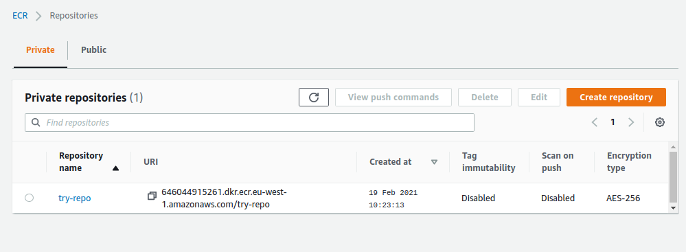
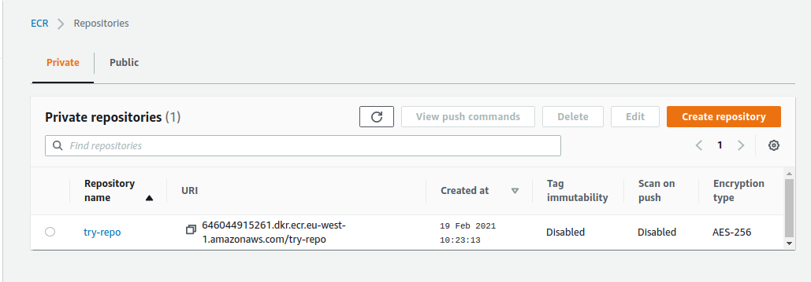

## Create ECR repo
Create ecr repo using terraform script 
```
provider "aws" {
  region = "eu-west-1"
}

resource "aws_ecr_repository" "trial-repository" {
  name                 = "try-repo"
  image_tag_mutability = "MUTABLE"
}
```
We can see repo in aws.

### To push docker image into ecr repo 

* Use the AWS CLI:
```
aws ecr get-login-password --region eu-west-1 | docker login --username AWS --password-stdin 646044915261.dkr.ecr.eu-west-1.amazonaws.com  # to login to ecr with docker 
```
* Build Docker image using the following command.
```
docker build -t <imagename> ./<dockerfilepath>
```
* After the build completes, tag your image so you can push the image to this repository:
```
docker tag <image_id/image_name> <aws_id>.dkr.ecr.eu-west-1.amazonaws.com/<image_name>
```
* Run the following command to push this image to your newly created AWS repository.
```
docker push <aws_id>.dkr.ecr.eu-west-1.amazonaws.com/<image_name>
```
Image is created in the repositry.
